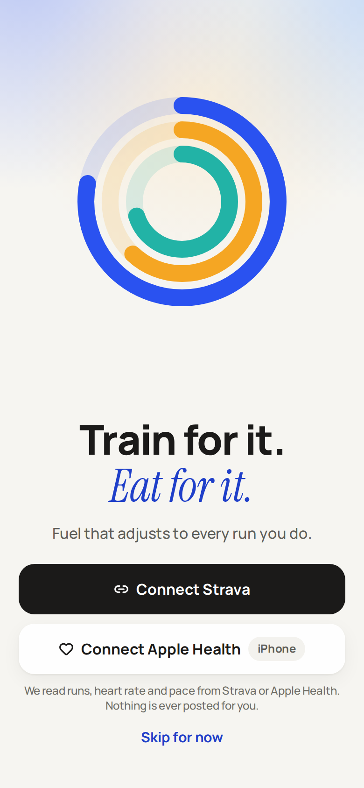
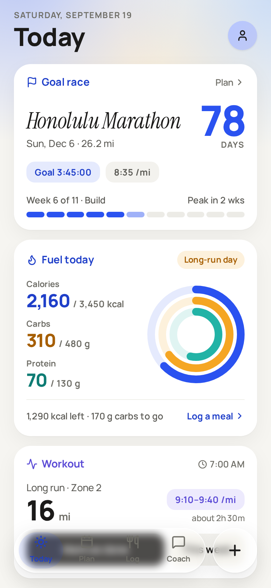
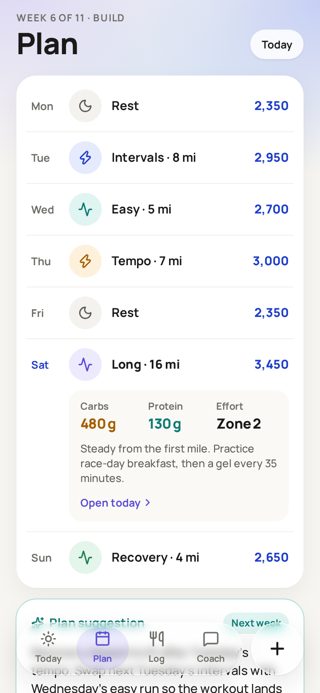
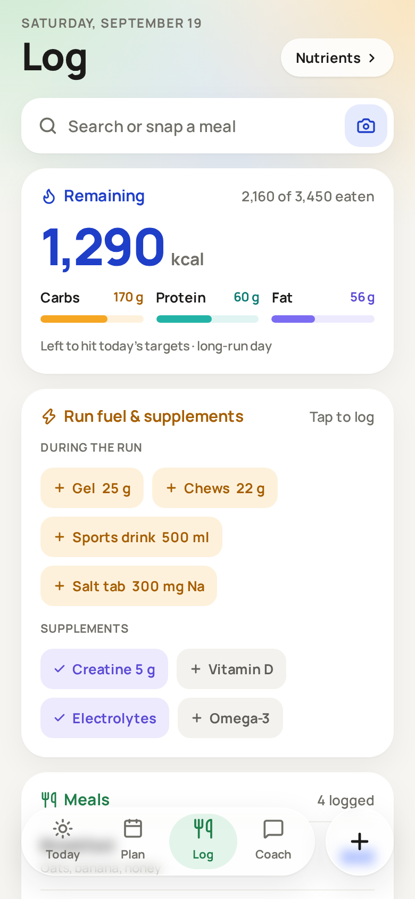

# Bubbie

**Train for it. *Eat for it.*** — a marathon / half-marathon training app where fuel adjusts to every run you do.

Calories and carbs follow the day's workout, protein stays steady, and the coach re-plans when a run differs,
intake is off, or you tell it something changed. You approve every change.

<p>
  
  
  
  
</p>

## Run it

```bash
npm install
npx expo start
```

Press `i` for the iOS simulator, `a` for Android, `w` for the browser. Requires Node 20+.

## What's here

- **Onboarding** — connect Strava / Apple Health, profile, goal race, plan preview
- **Today** — goal race countdown, calorie / carb / protein rings against today's targets, the workout,
  the before / during / after fueling protocol, week vs. plan, tomorrow, recovery
- **Plan** — the week (tap a day), an adaptive suggestion you can apply, the whole training block
- **Log** — what's left today, run fuel and supplements, meals, hydration, micros
- **Coach** — the injury conversation with a working "Update my plan"
- **Sheets** — *Plan updated* (a run synced from Strava) and *Yesterday* (morning recap)

Everything runs on sample data and a first-pass fuel engine (`src/lib/fuel.ts`). Integrations are the next step —
see the roadmap in [`CLAUDE.md`](CLAUDE.md).

## Working on it with Claude Code

Open the folder in Claude Code. `CLAUDE.md` carries the design rules, repo map, state model and roadmap;
`design/DESIGN.md` is the visual spec; `design/canvas/` are the original wireframes.

```bash
npm run typecheck   # must pass before committing
```
